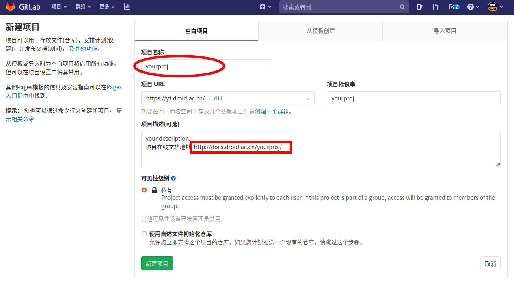

# 如何使用gitlab同步技术文档项目模板

## 创建gitlab项目

正常在gitlab中创建一个你的新项目，在项目描述中可先填上项目即将生成的在线文档地址，方便后续查看，如http://docs.droid.ac.cn/xarm/ 。



## 复制项目模板文件

项目模板的文件系统如下。

projtemp/
└── docs
    ├── make.bat
    ├── Makefile
    └── source
        ├── conf.py
        ├── how-to-use.md
        ├── imgs
        │   └── newproj.png
        ├── index.rst
        └── sphinx-to-mkdocs.md

复制本项目的三个文件.gitlab-ci.yml，.gitignore，docs/文件夹到您的项目根目录，如您已有.gitignore文件，则请在文件中加入docs/build/。

## 修改配置文件

需要修改的配置文件有以下几处：

### docs/source/conf.py

```python
# Configuration file for the Sphinx documentation builder.
#
# This file only contains a selection of the most common options. For a full
# list see the documentation:
# https://www.sphinx-doc.org/en/master/usage/configuration.html

# -- Path setup --------------------------------------------------------------

# If extensions (or modules to document with autodoc) are in another directory,
# add these directories to sys.path here. If the directory is relative to the
# documentation root, use os.path.abspath to make it absolute, like shown here.
#
# import os
# import sys
# sys.path.insert(0, os.path.abspath('.'))


# -- Project information -----------------------------------------------------

project = 'projtemp'
copyright = '2020, rocwang'
author = 'rocwang'


# -- General configuration ---------------------------------------------------

# Add any Sphinx extension module names here, as strings. They can be
# extensions coming with Sphinx (named 'sphinx.ext.*') or your custom
# ones.
extensions = ['recommonmark']

source_suffix = {
    '.rst': 'restructuredtext',
    '.txt': 'markdown',
    '.md': 'markdown',
}

# The language for content autogenerated by Sphinx. Refer to documentation
# for a list of supported languages.
#
# This is also used if you do content translation via gettext catalogs.
# Usually you set "language" from the command line for these cases.
language = 'zh'

# List of patterns, relative to source directory, that match files and
# directories to ignore when looking for source files.
# This pattern also affects html_static_path and html_extra_path.
exclude_patterns = ['_build', 'Thumbs.db', '.DS_Store']


# -- Options for HTML output -------------------------------------------------

# The theme to use for HTML and HTML Help pages.  See the documentation for
# a list of builtin themes.
#
html_theme = 'sphinx_rtd_theme'


```

将projtemp替换成你的项目名称，copyright以及author也可按照实际情况修改，其他地方保持一致。

### index.rst

```rst
.. rocdocs documentation master file, created by
   sphinx-quickstart on Sat May 30 13:26:40 2020.
   You can adapt this file completely to your liking, but it should at least
   contain the root `toctree` directive.

欢迎使用gitlab同步技术文档项目模板
===================================

.. toctree::
   :maxdepth: 2
   :caption: 文档目录:

   how-to-use
   sphinx-to-mkdocs


Indices and tables
==================

下载本文档： http://docs.droid.ac.cn/projtemp/latex/projtemp.pdf

* :ref:`genindex`
* :ref:`modindex`
* :ref:`search`

```

该文件为项目文档的目录和结构，同样修改projtemp为你的项目名，更改第一组==上面的文档标题，修改caption下面的内容为你编写的技术文档的md文件名，不带后缀。

### .gitlab-ci.yml

```xml
stages:
  - build
  - test
  - deploy
  - build-pages


pages:
  stage: build-pages
  only:
      - master
  tags:
      - robotnj
  script:
    - cd docs
    - sphinx-build -b html source build
    - make latexpdf
    - rm -rf /var/www/html/projtemp/
    - cp -rf build /var/www/html/projtemp/

```

此处需要修改的only项为你想要触发CI的分支名，如master，tags为gitlab-runner，此处部署了robotnj，以上script中为编译文档的作业，同样更改projtemp为你的项目名即可。

## 编写代码

此时即可开始按照你自己的需求编写项目代码。


## 编写项目技术文档

项目技术文档位于docs/source/目录下，目前支持md格式和rst格式，添加了新的md文件或者rst文件后请务必在index.rst文件中加入，否则文档将只编译不显示该文件内容。

## 提交项目代码与文档

正常提交该项目代码到gitlab即可，在项目CI/CD中即可看到触发分支的作业流水线。